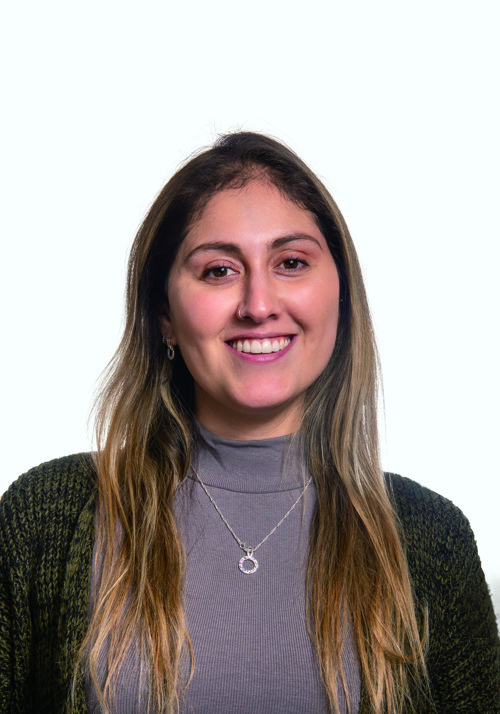

 

<table align="center">
<tr>
<td width="160" align="center">

</td>
<td align="left">

# Fernanda Pardo Durán

</td>
</tr>
</table>

 

 

## 👋 Sobre mí

> Ingeniera Civil Industrial con **6+ años de experiencia** liderando transformación de negocio, mejora de procesos y gestión de socios estratégicos en la industria aseguradora. Coordiné proyectos transversales entre negocio, operaciones y tecnología — desde el levantamiento de requerimientos hasta la puesta en producción.
>
> Hoy sumo a ese recorrido el **Curso de Especialidad en Product Owner** (Instituto ISEG · Talento Digital SENCE), incorporando Lean Startup, Design Thinking, Scrum y gestión ágil de productos.

<table align="center">
<tr>
<td align="center" width="160">🔍 <b>Análisis</b> KPIs & procesos</td>
<td align="center" width="160">🤝 <b>Stakeholders</b> Bancos & socios</td>
<td align="center" width="160">🚀 <b>Transformación</b> Digital & Agile</td>
<td align="center" width="160">🧩 <b>Equipos</b> Multidisciplinarios</td>
</tr>
</table>

## 🎯 Propósito profesional

Busco dar el salto hacia roles **Junior en tecnología / Product Owner**, combinando experiencia real gestionando procesos, KPIs y equipos con prácticas ágiles — aportando mirada de negocio a equipos de producto y transformación digital.

## 🧰 Herramientas y tecnologías

 

## 💼 Experiencia destacada

<table>
<tr><td width="140"><b>2023 – 2024</b></td><td>

**Líder de Transformación y Procesos** — BNP Paribas Cardif Chile
Digitalización de venta/postventa · resolución de incidencias en plataformas digitales · levantamiento de requerimientos y wireframes para un nuevo producto financiero.

</td></tr>
<tr><td><b>2022 – 2023</b></td><td>

**Jefa de Equipo — Seguimiento de Negocio (Banca)** — BNP Paribas Cardif Chile
Coordinación con Banco Itaú, Banco Santander y Banco de Chile · reportes ejecutivos de ventas, siniestros y recaudación.

</td></tr>
<tr><td><b>2018 – 2021</b></td><td>

**Ingeniera de Implementación de Nuevos Negocios** — BNP Paribas Cardif Chile
Implementación end-to-end de productos de seguros · alianza estratégica Scotiabank–Cencosud (migración de cartera y estabilización operativa).

</td></tr>
</table>

<b>Ver trayectoria completa</b> (Gestora de Cuenta, Jefa de Canales Remotos y más)

 

**Jefa de Equipo — Canales Remotos** — BNP Paribas Cardif Chile *(2021–2022)*
Supervisión de canales de telemarketing y emisión de pólizas · tableros de control para el producto SOAP.

**Gestora de Cuenta — Coopeuch** — BNP Paribas Cardif Chile *(2021)*
Relación operativa con Coopeuch · mejoras en procesos de cobranza y activación de mandatos.

## 🎓 Formación

- 🎓 **Ingeniería Civil Industrial** — Pontificia Universidad Católica de Valparaíso *(2017)*
- 📈 **Forward Program** — McKinsey.org *(2026)*
- 🧭 **Curso de Especialidad Product Owner** — Instituto ISEG / Talento Digital SENCE *(en curso · término 09/2026)*

## 📫 Conversemos

